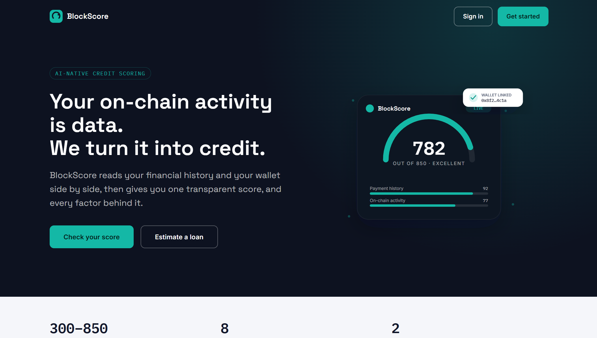

# BlockScore


## Blockchain-Based Credit Scoring Platform

BlockScore is a credit scoring platform: a Flask backend for auth, credit scoring, loan applications, and blockchain-anchored records, paired with a React web dashboard and a React Native mobile app. Credit scores are computed from a real, multi-factor rule-based engine (payment history, utilization, length of history, credit mix, and more), with an optional trained model that's used when present and falls back to the rule-based engine when it isn't.

<div align="center">
  
</div>

## Table of Contents

- [Overview](#overview)
- [Project Structure](#project-structure)
- [Feature Status](#feature-status)
- [Technology Stack](#technology-stack)
- [Architecture](#architecture)
- [Installation and Setup](#installation-and-setup)
- [Running the Stack](#running-the-stack)
- [API Surface](#api-surface)
- [Testing](#testing)
- [CI/CD Pipeline](#cicd-pipeline)
- [Documentation](#documentation)
- [Contributing](#contributing)
- [License](#license)

## Overview

BlockScore demonstrates a credit-scoring workflow across a real, runnable codebase. The live Flask backend, Hardhat smart contracts, and both frontends are wired and covered by tests. `code/ai_models` also contains its own separate Flask server for model serving, but the main backend doesn't call it over HTTP; it loads the same trained model file directly from disk instead. A handful of standalone Node.js modules (a web3.js contract service, a JWT auth service) exist in `code/backend` but, per that directory's own `package.json`, aren't wired into any server.

## Project Structure

```
BlockScore/
├── code/
│   ├── backend/                # Flask application (the live backend)
│   │   ├── app.py              # All routes: auth, credit, loans, profile
│   │   ├── services/           # credit, blockchain, auth, mfa, compliance, audit
│   │   ├── models/              # SQLAlchemy models
│   │   ├── utils/                # background_jobs.py (Celery)
│   │   └── tests/                 # unit and integration test suites
│   ├── blockchain/               # Hardhat project
│   │   ├── contracts/            # CreditScore(V2), LoanContract(V2), GovernanceToken
│   │   └── tests/                 # Hardhat test suite
│   └── ai_models/                  # Credit-scoring model training and its own Flask
│                                    # serving API (not called by code/backend)
├── web-frontend/                    # React (Vite) dashboard
├── mobile-frontend/                   # React Native app
├── infrastructure/                     # Docker, Kubernetes, Terraform, Ansible, monitoring
├── scripts/                             # Setup, run, lint, and deployment scripts
├── docs/                                 # Documentation (this directory)
└── README.md
```

## Feature Status

### Application tier (wired and tested)

| Component           | Details                                                                                                                                                                                                                                                                                                                                                         |
| :------------------ | :-------------------------------------------------------------------------------------------------------------------------------------------------------------------------------------------------------------------------------------------------------------------------------------------------------------------------------------------------------------- |
| **API**             | A Flask application with all routes defined directly in `app.py`: health, auth (register, login, logout, refresh), credit (score calculation, history), loans (apply, calculate, list, anchor to blockchain), and profile.                                                                                                                                      |
| **Auth**            | JWT sessions with bcrypt password hashing, plus a real MFA service. `SECRET_KEY` and `JWT_SECRET_KEY` both fall back to static placeholder values with no check that rejects them in production.                                                                                                                                                                |
| **Credit scoring**  | A multi-factor rule-based engine computing payment history, credit utilization, length of history, credit mix, new credit, income stability, and debt-to-income factors, combined into a score. If a trained model file (`credit_scoring_model.pkl`) is present, it's loaded and used; otherwise the service falls back to the rule-based engine automatically. |
| **Background jobs** | A real Celery app (`utils/background_jobs.py`), backed by Redis and run through its own `celery_worker` container in Docker Compose.                                                                                                                                                                                                                            |
| **Smart contracts** | Hardhat-managed Solidity contracts: `CreditScore` and `CreditScoreV2`, `LoanContract` and `LoanContractV2`, and a `GovernanceToken`, read and written via a genuine web3.py-backed blockchain service.                                                                                                                                                          |
| **Web dashboard**   | React app (plain JavaScript, Vite, Material-UI, Chart.js) covering the dashboard, credit score, loans, profile, and authentication screens.                                                                                                                                                                                                                     |
| **Mobile app**      | React Native app (TypeScript) covering Dashboard, Login, Profile, and Register screens, with Redux Toolkit for state, React Navigation, and React Native Elements (`@rneui`) for UI components.                                                                                                                                                                 |

### Standalone modules (not called by the live backend)

| Component                         | Details                                                                                                                                                                                                                                                                   |
| :-------------------------------- | :------------------------------------------------------------------------------------------------------------------------------------------------------------------------------------------------------------------------------------------------------------------------ |
| **AI model training and serving** | `code/ai_models` has its own training script and a separate Flask API for model inference; `code/backend` loads the trained `.pkl` file directly from disk rather than calling this API over HTTP.                                                                        |
| **Node.js service modules**       | `services/contractService.js` (web3.js), `services/authService.js`, and `middleware/auth.js` in `code/backend` are real, installable modules, but per that directory's own `package.json`, there is no `app.js` or `routes/` directory wiring them into a running server. |

## Technology Stack

| Area                | Technology                                                                                             |
| :------------------ | :----------------------------------------------------------------------------------------------------- |
| Blockchain          | Solidity, OpenZeppelin, Hardhat                                                                        |
| Backend API         | Python 3.11+, Flask, Flask-SQLAlchemy, Gunicorn                                                        |
| Auth                | PyJWT, bcrypt, an in-house MFA service                                                                 |
| Data layer          | SQLAlchemy 2, PostgreSQL (SQLite for local development), Redis                                         |
| Background jobs     | Celery                                                                                                 |
| ML (credit scoring) | scikit-learn, XGBoost, SHAP for explainability; a rule-based fallback when no trained model is present |
| Web frontend        | React 18, JavaScript, Vite, Material-UI (MUI), Emotion, Chart.js, axios                                |
| Mobile frontend     | React Native, TypeScript, Redux Toolkit, React Navigation, React Native Elements (`@rneui`)            |
| Infrastructure      | Docker, Docker Compose, Kubernetes, Terraform, Ansible                                                 |
| Monitoring          | Prometheus, Grafana                                                                                    |
| CI/CD               | GitHub Actions                                                                                         |
| Testing             | pytest (backend), Hardhat (contracts), Vitest (web), Jest (mobile)                                     |

`d3` and `web3` are both listed in `web-frontend/package.json` but aren't imported anywhere in the frontend source; Chart.js is what's actually used for charts.

## Architecture

```
Clients
  ├── web-frontend (React)               ── HTTP/JSON ──┐
  └── mobile-frontend (React Native)     ── HTTP/JSON ──┤
                                                        ▼
Backend (Flask, all routes in app.py)
  ├── Routes    health, auth, credit, loans, profile
  ├── Services   credit (rule-based + optional trained model), blockchain (web3.py),
  │              auth, mfa, compliance, audit
  ├── Background   Celery worker (Redis-backed)
  └── Data layer     PostgreSQL (SQLAlchemy), SQLite for local dev

Blockchain (Hardhat / Solidity)
  CreditScore · CreditScoreV2 · LoanContract · LoanContractV2 · GovernanceToken

AI model service (code/ai_models, standalone)
  Training script + its own Flask serving API; code/backend reads the trained
  .pkl file directly from disk rather than calling this API
```

See [docs/architecture.md](docs/architecture.md) for detail.

## Installation and Setup

Prerequisites: Python 3.11+ and Node.js 18+.

```bash
git clone https://github.com/quantsingularity/BlockScore.git
cd BlockScore

# Blockchain
cd code/blockchain
npm install

# Backend
cd ../backend
python -m venv .venv && source .venv/bin/activate
pip install -r requirements.txt

# Web frontend
cd ../../web-frontend
npm install

# Mobile frontend
cd ../mobile-frontend
npm install
```

For an automated setup:

```bash
git clone https://github.com/quantsingularity/BlockScore.git
cd BlockScore
./scripts/setup_blockscore_env.sh
./scripts/run_blockscore.sh
```

Full, environment-specific instructions are in [docs/INSTALLATION.md](docs/INSTALLATION.md).

## Running the Stack

```bash
# Full local stack, including Postgres, Redis, the AI model server, and a
# Celery worker (from code/, Docker required)
docker compose up -d

# Or run components individually:

# Backend (from code/backend, venv active)
python app.py                      # serves http://0.0.0.0:5000

# Web dashboard (from web-frontend)
npm run dev

# Mobile app (from mobile-frontend)
npm start
```

See [docs/usage.md](docs/usage.md) and [docs/CONFIGURATION.md](docs/CONFIGURATION.md).

## API Surface

Base URL `http://localhost:5000/api`.

| Group   | Highlights                                                                                   |
| :------ | :------------------------------------------------------------------------------------------- |
| Health  | `health`                                                                                     |
| Auth    | `auth/register`, `auth/login`, `auth/logout`, `auth/refresh`                                 |
| Credit  | `credit/calculate-score`, `credit/history`                                                   |
| Loans   | `loans/apply`, `loans/calculate`, `loans/applications`, `loans/applications/{id}/blockchain` |
| Profile | `profile` (get and update)                                                                   |

Full request and response shapes are in [docs/API.md](docs/API.md).

## Testing

```bash
# Backend (from code/backend)
pytest

# Smart contracts (from code/blockchain)
npx hardhat test

# Web (from web-frontend)
npm test

# Mobile (from mobile-frontend)
npm test
```

The backend suite has 3 unit test files and 1 integration test file. The Hardhat suite has 5 files covering the contracts. The web dashboard has 11 test files (Vitest); the mobile app has 1 (Jest).

## CI/CD Pipeline

GitHub Actions (`.github/workflows/cicd.yml`) runs four jobs on push, pull request, and manual dispatch:

| Job                           | Depends on          | What it does                                                                       |
| :---------------------------- | :------------------ | :--------------------------------------------------------------------------------- |
| Code Quality Checks           | -                   | Python formatter checks (autoflake, black) and a repository-wide Prettier check    |
| Backend Tests                 | Code Quality Checks | Runs the pytest suite with coverage and uploads the coverage report as an artifact |
| Smart Contract Compile & Test | Code Quality Checks | Compiles the contracts with Hardhat and runs the contract test suite               |
| Frontend Build                | Code Quality Checks | Installs dependencies and produces the production web build (no test step)         |

There is currently no CI job for the mobile app or for `code/ai_models`.

## Documentation

| Document                                           | Contents                               |
| :------------------------------------------------- | :------------------------------------- |
| [docs/README.md](docs/README.md)                   | Documentation index                    |
| [docs/architecture.md](docs/architecture.md)       | System architecture                    |
| [docs/API.md](docs/API.md)                         | REST API reference                     |
| [docs/QUICKSTART.md](docs/QUICKSTART.md)           | Fast-track setup guide                 |
| [docs/INSTALLATION.md](docs/INSTALLATION.md)       | Setup for all components               |
| [docs/deployment.md](docs/deployment.md)           | Deployment procedures                  |
| [docs/CONFIGURATION.md](docs/CONFIGURATION.md)     | Environment variables and config       |
| [docs/usage.md](docs/usage.md)                     | Running and using the platform         |
| [docs/CLI.md](docs/CLI.md)                         | Helper scripts reference               |
| [docs/FEATURE_MATRIX.md](docs/FEATURE_MATRIX.md)   | Feature status, implemented vs planned |
| [docs/SMART_CONTRACTS.md](docs/SMART_CONTRACTS.md) | Contract architecture and interfaces   |
| [docs/SECURITY.md](docs/SECURITY.md)               | Security model and disclosure process  |
| [docs/troubleshooting.md](docs/troubleshooting.md) | Common issues and fixes                |
| [docs/CONTRIBUTING.md](docs/CONTRIBUTING.md)       | Contribution guide                     |
| [docs/examples/](docs/examples/)                   | Worked examples                        |

## Contributing

See [docs/CONTRIBUTING.md](docs/CONTRIBUTING.md).

## License

This project is licensed under the MIT License - see the [LICENSE](LICENSE) file for details.
